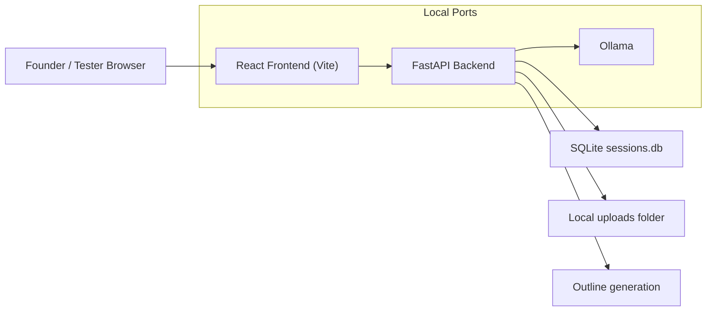
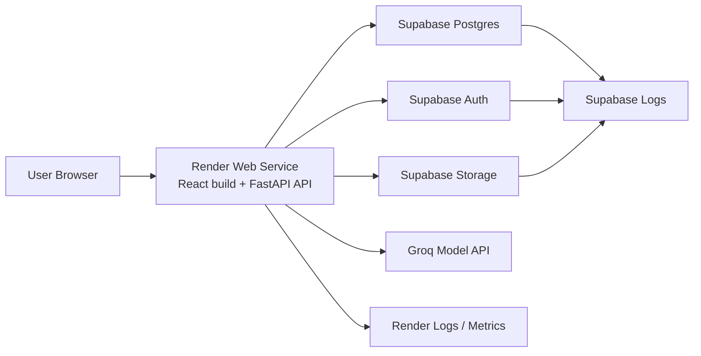
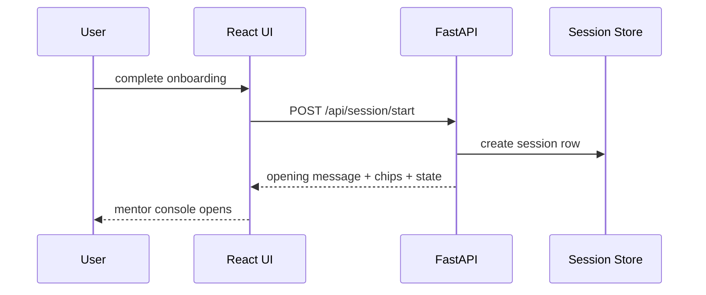
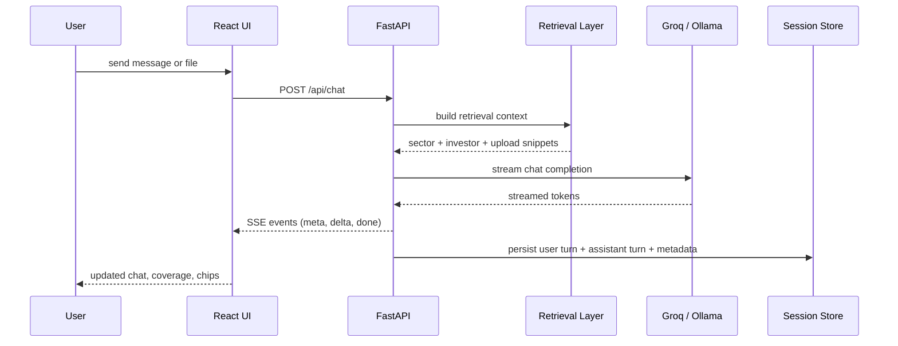
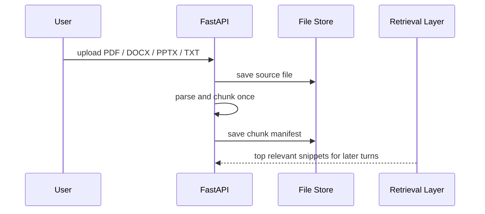
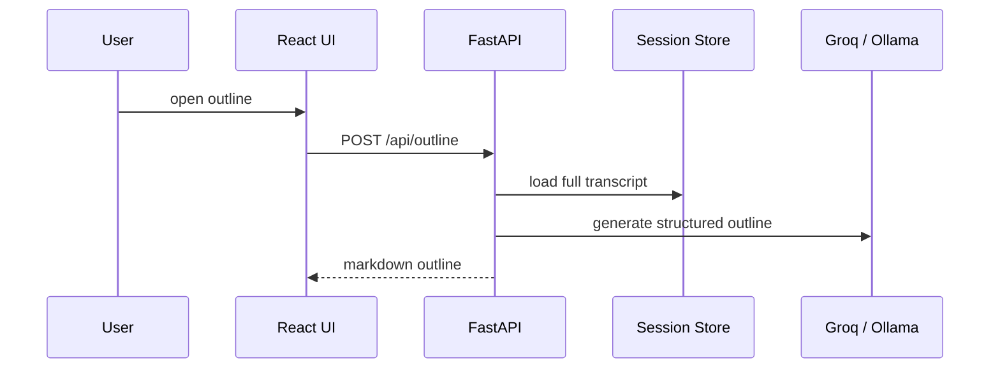

# Vishwakarma Architecture

This document explains how Vishwakarma works today, how it should run in production for the MVP, and what to monitor.

It is written for product and technical review, so it can be shared directly with a co-founder.

## Product Goal

Vishwakarma is a pitch-deck mentor, not a generic chatbot.

The product should:
- help founders clarify the real problem
- test assumptions with evidence
- stay grounded in customer discovery and early validation
- adapt tone by founder type and stage
- turn conversations into a cleaner pitch outline

## Recommended MVP Stack

For the best POC / MVP deployment:

- `Frontend + API hosting`: Render web service
- `Database`: Supabase Postgres
- `File storage`: Supabase Storage
- `Auth`: Supabase Auth
- `Model inference`: Groq in production, Ollama locally
- `Monitoring`: Render metrics + logs, Supabase logs, in-app usage tracking

## 1. Current Local Architecture

Use this for local development and private testing.



### Local runtime modes

#### Single-port local app

```text
Browser -> http://127.0.0.1:7860
```

This is started by:

```bash
python3 vk.py --build
```

The backend serves the built frontend and API from one process.

#### Dev mode

```text
Frontend: http://127.0.0.1:5173
Backend:  http://127.0.0.1:8000
Ollama:   http://127.0.0.1:11434
```

This is started by:

```bash
npm run dev
```

## 2. Recommended MVP Production Architecture

This is the architecture recommended for sharing the product with a co-founder and early testers.



### Why this shape

- one deployed service is simpler than splitting frontend and backend too early
- Render fits the current Dockerized FastAPI app well
- Supabase replaces local SQLite and local upload storage
- Groq removes the need to run Ollama on the internet-facing deployment

## 3. Request Workflow

### Session start workflow



### Chat workflow



### Upload workflow



### Outline workflow



## 4. Core App Modules

### Frontend

- `frontend/src/app/App.tsx`
- `frontend/src/features/onboarding/OnboardingCard.tsx`
- `frontend/src/features/chat/ChatScreen.tsx`
- `frontend/src/features/outline/OutlineScreen.tsx`

Responsibilities:
- onboarding
- session resume
- chat shell
- streaming response rendering
- outline view
- heartbeat for local auto-stop

### Backend API

- `backend/main.py`
- `backend/api/session.py`
- `backend/api/chat.py`
- `backend/api/outline.py`
- `backend/api/client.py`

Responsibilities:
- session start and load
- streaming chat events
- outline generation
- heartbeat handling
- frontend asset serving in single-port mode

### Backend services

- `backend/services/prompting.py`
- `backend/services/retrieval.py`
- `backend/services/external_sources.py`
- `backend/services/model_router.py`
- `backend/services/state_engine.py`
- `backend/services/uploads.py`

Responsibilities:
- mentor behavior rules
- compact retrieval context
- external VC / startup question lenses
- model routing and fallback
- deterministic state updates
- upload parsing and snippet retrieval

### Persistence

Current local storage:
- `memory.py` -> SQLite at `data/sessions.db`
- `backend/services/uploads.py` -> `data/session_uploads/`

Recommended production storage:
- Supabase Postgres
- Supabase Storage

## 5. Ports And Endpoints To Monitor

### Local ports

| Port | Service | Why it matters |
|---|---|---|
| `7860` | single-port local app | normal local testing |
| `8000` | FastAPI backend | API health and backend debugging |
| `5173` | Vite frontend | frontend dev only |
| `11434` | Ollama | local model runtime |

### Local endpoints

| Endpoint | Purpose |
|---|---|
| `/api/health` | health check |
| `/api/session/start` | session creation |
| `/api/session` | list user sessions |
| `/api/chat` | streamed chat |
| `/api/outline` | outline generation |
| `/api/client/heartbeat` | local app browser heartbeat |

### Production ports

In production, users should access only HTTPS:

```text
https://your-domain.com
```

Internally:
- Render container listens on port `8000`
- Supabase and Groq are external managed services

## 6. What To Monitor

### Render

Monitor:
- request volume
- error rate
- p95 latency
- memory usage
- container restarts
- deploy success/failure

Where:
- Render service logs
- Render service metrics

### Supabase

Monitor:
- auth logins
- database errors
- slow queries
- storage errors
- file upload failures

Where:
- Supabase logs
- Supabase dashboard

### Model provider

Monitor:
- response latency
- timeout rate
- quota / credit usage
- model errors

Where:
- Groq console

### In-app product analytics

You should track these yourself in the database:

- who signed in
- who opened the app
- who started a session
- who resumed a session
- who uploaded a file
- how many turns each session had
- first token latency
- total response latency
- which response profile was used
- whether fallback happened
- whether the outline was opened

This matters more than generic pageview analytics because this is a workflow product.

## 7. Web Analytics Recommendation

For MVP, separate analytics into two layers.

### Product analytics

Best for admin understanding:
- user identity
- session usage
- feature usage
- upload behavior
- mentor latency

This should live inside your app database.

### Traffic analytics

Best for traffic patterns:
- unique visitors
- countries / cities
- devices
- page load performance

If you later move the frontend to Vercel, Vercel Web Analytics is useful for this layer.

For the current recommended MVP stack, traffic analytics are optional. Product analytics are the priority.

## 8. Recommended Admin View

For your admin perspective, build a simple internal dashboard that shows:

- signed-in users
- sessions per user
- active sessions this week
- average turns per session
- uploads per session
- outline opens
- model profile usage
- response latency trends
- error counts

Suggested sections:

1. `Users`
2. `Sessions`
3. `Uploads`
4. `Latency`
5. `Errors`

## 9. Suggested Environment Split

### Local

- Ollama
- SQLite
- local uploads
- `python3 vk.py --build`

### MVP / staging

- Render
- Supabase
- Groq
- invite-only auth

### Later production

- optional Vercel frontend
- Render or another container host for API
- same Supabase backend
- stronger analytics and alerting

## 10. Short Summary

Today:
- local-first app
- React + FastAPI
- Ollama
- SQLite
- local upload storage

Best MVP deployment:
- Render web service
- Supabase Postgres + Storage + Auth
- Groq inference
- internal product analytics

Main technical reason:
- your current app needs a real backend process and persistent storage, so full-stack Vercel is the wrong fit right now.
