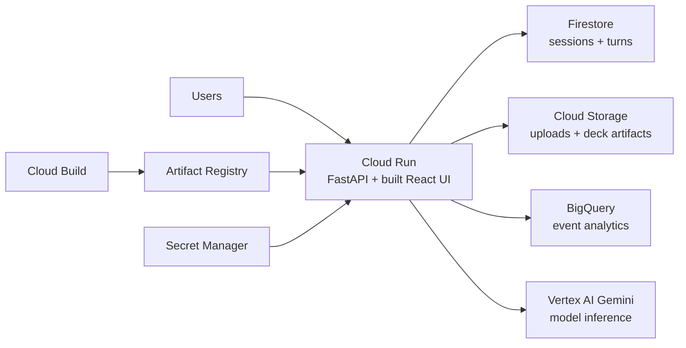

# Google Cloud Serverless Deployment

This guide deploys Sift to Google Cloud project `sift-495116` as a shareable, serverless web app.

## Target Architecture



Why this shape:

- `Cloud Run` gives a serverless HTTPS app with autoscaling.
- `Firestore` removes the SQLite/local-disk bottleneck for session state.
- `Cloud Storage` keeps uploads durable across Cloud Run instances.
- `BigQuery` receives product analytics events for reporting.
- `Vertex AI` lets the runtime call Gemini with Google Cloud IAM and project billing.
- `FastAPI` stays the public REST API surface; the built React frontend is served by the same container.

## One-Time Setup

Run from the repo root after installing and logging in to the Google Cloud CLI.

```bash
export PROJECT_ID=sift-495116
export REGION=us-central1
export SERVICE_NAME=sift
export ARTIFACT_REPOSITORY=sift
export UPLOAD_BUCKET=sift-495116-sift-uploads
export RUNTIME_SA=sift-runner@$PROJECT_ID.iam.gserviceaccount.com

gcloud config set project $PROJECT_ID

gcloud services enable \
  run.googleapis.com \
  cloudbuild.googleapis.com \
  artifactregistry.googleapis.com \
  firestore.googleapis.com \
  storage.googleapis.com \
  bigquery.googleapis.com \
  aiplatform.googleapis.com \
  secretmanager.googleapis.com \
  iam.googleapis.com
```

Create the runtime service account:

```bash
gcloud iam service-accounts create sift-runner \
  --display-name="Sift Cloud Run runtime"
```

Create Artifact Registry:

```bash
gcloud artifacts repositories create $ARTIFACT_REPOSITORY \
  --repository-format=docker \
  --location=$REGION \
  --description="Sift containers"
```

Create Firestore in native mode. If your project already has a Firestore database, skip this.

```bash
gcloud firestore databases create --location=$REGION
```

Create Cloud Storage for uploads:

```bash
gcloud storage buckets create gs://$UPLOAD_BUCKET \
  --location=$REGION \
  --uniform-bucket-level-access \
  --public-access-prevention
```

Create BigQuery analytics storage:

```bash
bq --location=US mk --dataset $PROJECT_ID:sift_analytics

bq mk \
  --table \
  $PROJECT_ID:sift_analytics.events \
  infra/gcp/bigquery_events_schema.json
```

Create secrets. Use a strong random value for `sift-session-secret`.

```bash
printf '%s' 'replace-with-strong-random-session-secret' | \
  gcloud secrets create sift-session-secret --data-file=-

printf '%s' 'replace-with-admin-token' | \
  gcloud secrets create sift-admin-token --data-file=-
```

Grant the runtime service account the minimum product permissions:

```bash
gcloud projects add-iam-policy-binding $PROJECT_ID \
  --member=serviceAccount:$RUNTIME_SA \
  --role=roles/datastore.user

gcloud storage buckets add-iam-policy-binding gs://$UPLOAD_BUCKET \
  --member=serviceAccount:$RUNTIME_SA \
  --role=roles/storage.objectAdmin

gcloud projects add-iam-policy-binding $PROJECT_ID \
  --member=serviceAccount:$RUNTIME_SA \
  --role=roles/bigquery.dataEditor

gcloud projects add-iam-policy-binding $PROJECT_ID \
  --member=serviceAccount:$RUNTIME_SA \
  --role=roles/aiplatform.user

for SECRET in sift-session-secret sift-admin-token; do
  gcloud secrets add-iam-policy-binding $SECRET \
    --member=serviceAccount:$RUNTIME_SA \
    --role=roles/secretmanager.secretAccessor
done
```

Let Cloud Build deploy as the runtime service account:

```bash
export PROJECT_NUMBER=$(gcloud projects describe $PROJECT_ID --format='value(projectNumber)')
export CLOUDBUILD_SA=$PROJECT_NUMBER@cloudbuild.gserviceaccount.com

gcloud projects add-iam-policy-binding $PROJECT_ID \
  --member=serviceAccount:$CLOUDBUILD_SA \
  --role=roles/run.admin

gcloud projects add-iam-policy-binding $PROJECT_ID \
  --member=serviceAccount:$CLOUDBUILD_SA \
  --role=roles/iam.serviceAccountUser

gcloud projects add-iam-policy-binding $PROJECT_ID \
  --member=serviceAccount:$CLOUDBUILD_SA \
  --role=roles/artifactregistry.writer

gcloud projects add-iam-policy-binding $PROJECT_ID \
  --member=serviceAccount:$CLOUDBUILD_SA \
  --role=roles/storage.admin
```

## Deploy

```bash
gcloud builds submit --region=$REGION --config=cloudbuild.yaml .
```

The deploy output will include the public Cloud Run URL. Users can open that URL directly.

Cloud Run gives each service a generated `run.app` URL. For a cleaner branded URL
such as `sift.yourdomain.com`, map a verified domain to the service and add the
DNS records that Google provides.

If you do not want to buy a domain, use Firebase Hosting's free `web.app`
front door. The current clean public link is `https://sift-vc.web.app`.

```bash
bash tools/deploy_clean_webapp_link.sh sift-vc
```

If that site id is unavailable, pick another globally unique id, for example:

```bash
bash tools/deploy_clean_webapp_link.sh sift-workbench
```

This gives users one clean link like `https://sift-vc.web.app`. Firebase
Hosting serves the React app and rewrites `/api/**` to the same Cloud Run
service, so OAuth callbacks and API calls stay under the one visible link.
Firebase Hosting has a 60-second timeout for dynamic Cloud Run rewrites, so
long deck reviews should use a fast vision model or an async job flow.

## Verify

```bash
SERVICE_URL=$(gcloud run services describe $SERVICE_NAME \
  --region=$REGION \
  --format='value(status.url)')

curl "$SERVICE_URL/api/health"
```

Expected health check signs:

- `status` is `ok`
- `persistence.backend` is `firestore`
- `uploads.backend` is `gcs`
- `expertCardCount` is non-zero
- `bigQuery.enabled` is `true`

Then test the product:

1. Start an Ideate session.
2. Start an Expert session.
3. Start an Evaluate session.
4. Upload a PDF/PPTX deck.
5. Check BigQuery:

```sql
SELECT event_type, COUNT(*) AS events
FROM `sift-495116.sift_analytics.events`
GROUP BY event_type
ORDER BY events DESC;
```

## Runtime Defaults

The included `cloudbuild.yaml` deploys with:

- `2 vCPU`, `2Gi` memory
- `min-instances=1` for low cold-start latency
- `max-instances=10`
- `concurrency=40`
- `timeout=300s`
- `SIFT_PERSISTENCE_BACKEND=firestore`
- `SIFT_UPLOAD_BACKEND=gcs`
- `SIFT_MODEL_PROVIDER=vertex`
- `SIFT_ENABLE_OLLAMA=false`
- `SIFT_ENABLE_LOCAL_OPENAI=false`
- `SIFT_DECK_REVIEW_PROVIDER=vertex`
- `SIFT_DECK_REVIEW_MODEL=gemini-2.5-flash`
- `SIFT_FRONTEND_URL=https://sift-vc.web.app`
- `SIFT_COOKIE_SAMESITE=none` for OAuth callbacks, including Apple's form post
- `VERTEX_LOCATION=us-central1`
- `VERTEX_MODEL_SPEED=gemini-2.5-flash`
- `VERTEX_MODEL_BALANCED=gemini-2.5-pro`

For higher throughput, increase `--max-instances` first. For lower latency, increase `--min-instances` after checking cost.

## Switching Model Providers

Vertex AI Gemini is the default GCP-native path in `cloudbuild.yaml`, so inference runs under project `sift-495116` with the Cloud Run runtime service account.
The UI still shows model presets for API-key providers, but Cloud Run hides local Ollama/OpenAI-compatible endpoints unless you explicitly enable and network them.

For open-source deck vision, provision an OpenAI-compatible endpoint such as a
vLLM/TGI service running Qwen VL, Pixtral, or Llama Vision, then update Cloud
Run:

```bash
gcloud run services update sift \
  --project=sift-495116 \
  --region=us-central1 \
  --update-env-vars=SIFT_ENABLE_OPEN_SOURCE_PROVIDER=true,SIFT_DECK_REVIEW_PROVIDER=open_source,SIFT_DECK_REVIEW_MODEL=Qwen/Qwen2.5-VL-7B-Instruct,OPEN_SOURCE_BASE_URL=https://your-open-source-endpoint/v1
```

If the endpoint requires a bearer token, store it as a secret and map it to
`OPEN_SOURCE_API_KEY`.

To use Groq instead:

1. Create a `groq-api-key` secret.
2. Change `SIFT_MODEL_PROVIDER=groq`.
3. Add `GROQ_API_KEY=groq-api-key:latest` to the `--set-secrets` mapping.

The app also supports OpenAI, OpenRouter, Anthropic, and Cerebras through environment variables.

## OAuth Sign-In

The code supports Google, Apple, LinkedIn, and X sign-in. Each provider only
appears in the UI after its client id and secret are present in Cloud Run.

For the clean public URL, register these callback URLs in the provider
developer consoles:

```text
https://sift-vc.web.app/api/auth/callback/google
https://sift-vc.web.app/api/auth/callback/apple
https://sift-vc.web.app/api/auth/callback/linkedin
https://sift-vc.web.app/api/auth/callback/x
```

Cloud Run should also keep `SIFT_FRONTEND_URL=https://sift-vc.web.app` so
outbound OAuth requests use the same callback URL. Apple sign-in posts back
cross-site, so production cookies use `SIFT_COOKIE_SAMESITE=none` with
`SIFT_COOKIE_SECURE=true`.

Recommended secret names:

```text
google-oauth-client-id
google-oauth-client-secret
apple-oauth-client-id
apple-oauth-client-secret
linkedin-oauth-client-id
linkedin-oauth-client-secret
x-oauth-client-id
x-oauth-client-secret
```

Export the eight provider-issued values locally, then run the helper. Do not
paste provider secrets into chat or commit them.

```bash
export GOOGLE_OAUTH_CLIENT_ID='...'
export GOOGLE_OAUTH_CLIENT_SECRET='...'
export APPLE_OAUTH_CLIENT_ID='...'
export APPLE_OAUTH_CLIENT_SECRET='...'
export LINKEDIN_OAUTH_CLIENT_ID='...'
export LINKEDIN_OAUTH_CLIENT_SECRET='...'
export X_OAUTH_CLIENT_ID='...'
export X_OAUTH_CLIENT_SECRET='...'

bash tools/configure_oauth_cloud_run.sh
```

Or map existing secrets to Cloud Run manually:

```bash
gcloud run services update sift \
  --project=sift-495116 \
  --region=us-central1 \
  --update-env-vars=SIFT_FRONTEND_URL=https://sift-vc.web.app,SIFT_CORS_ORIGINS=https://sift-vc.web.app,SIFT_COOKIE_SECURE=true,SIFT_COOKIE_SAMESITE=none \
  --update-secrets=GOOGLE_OAUTH_CLIENT_ID=google-oauth-client-id:latest,GOOGLE_OAUTH_CLIENT_SECRET=google-oauth-client-secret:latest,APPLE_OAUTH_CLIENT_ID=apple-oauth-client-id:latest,APPLE_OAUTH_CLIENT_SECRET=apple-oauth-client-secret:latest,LINKEDIN_OAUTH_CLIENT_ID=linkedin-oauth-client-id:latest,LINKEDIN_OAUTH_CLIENT_SECRET=linkedin-oauth-client-secret:latest,X_OAUTH_CLIENT_ID=x-oauth-client-id:latest,X_OAUTH_CLIENT_SECRET=x-oauth-client-secret:latest
```

## What Changed For GCP

- `cloudbuild.yaml` builds and deploys the container to Cloud Run.
- `backend/core/memory.py` supports Firestore when `SIFT_PERSISTENCE_BACKEND=firestore`.
- `backend/services/uploads.py` supports Cloud Storage when `SIFT_UPLOAD_BACKEND=gcs`.
- `backend/core/bigquery_analytics.py` streams analytics events to BigQuery when configured.
- `infra/gcp/bigquery_events_schema.json` defines the analytics table.
