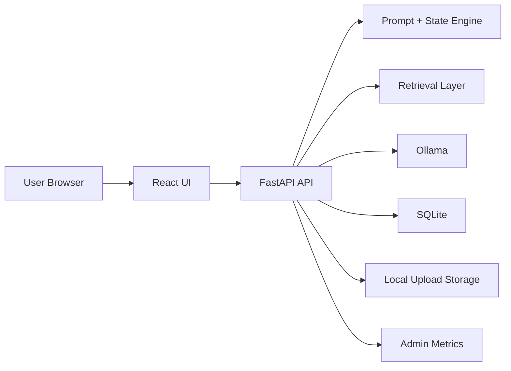
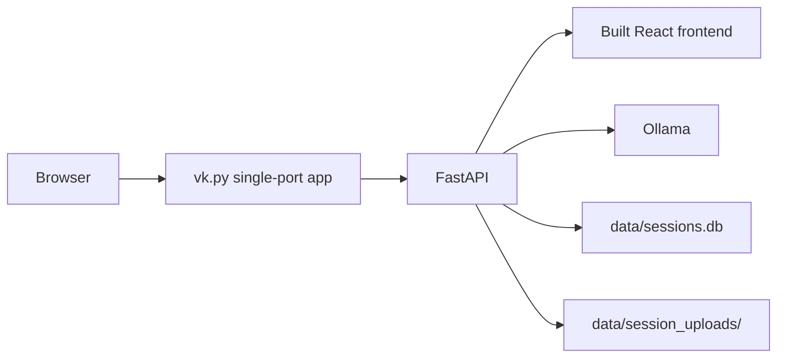
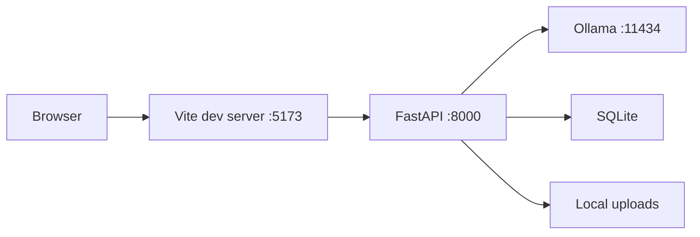
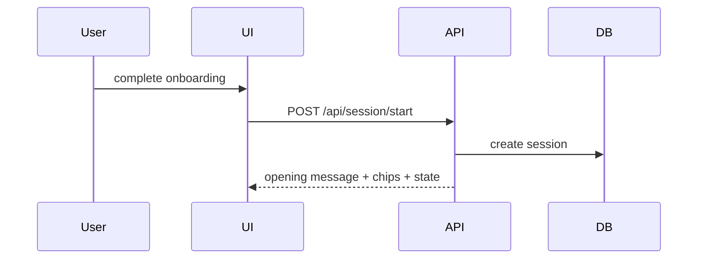
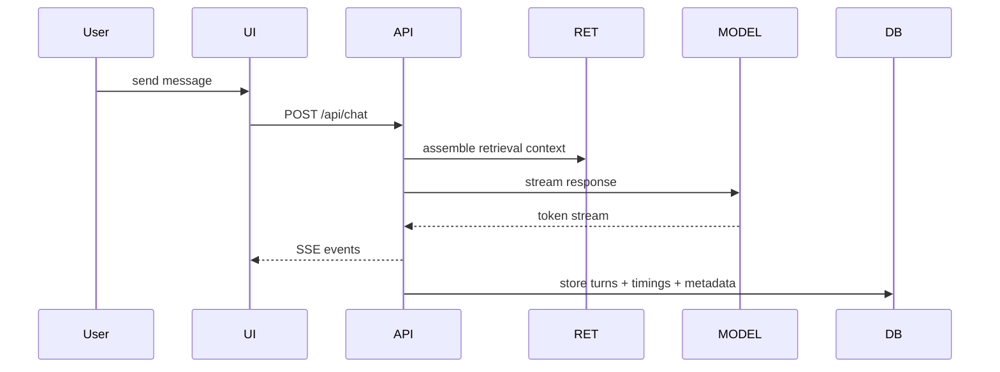
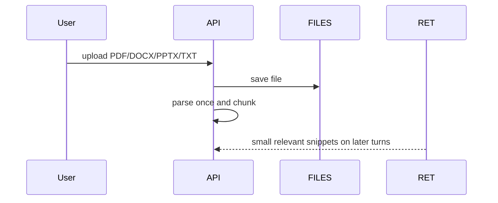
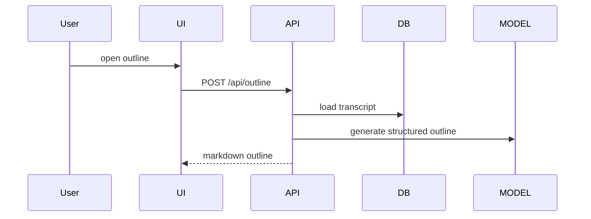
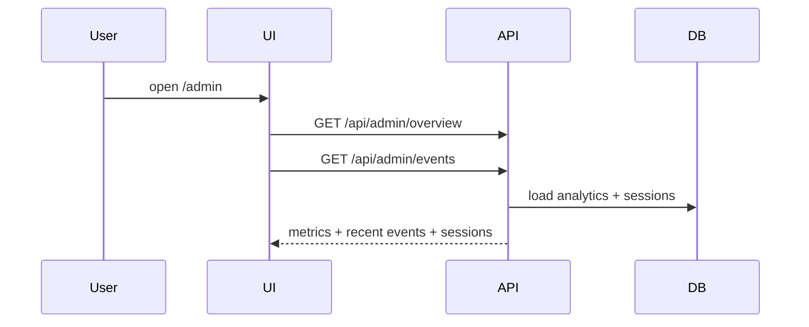

# Vishwakarma Platform Overview

This is the single handoff document for the current Vishwakarma platform.

It explains:
- what the product is
- what the current MVP includes
- the complete architecture
- the major components
- the supported use cases
- the key routes and ports
- the exact commands to configure and run it

This document is written for founder, product, and technical review.

## 1. What Vishwakarma Is

Vishwakarma is a pitch-deck mentor.

It is not meant to behave like a generic chatbot.

Its job is to help a founder or student innovator:
- clarify the real problem
- test assumptions
- think in terms of customer evidence, not just opinions
- explain the business in simple language when needed
- turn a messy idea into a sharper pitch outline

## 2. Current MVP Scope

The current MVP is fully open-source-only and local-first.

It uses:
- `React` frontend
- `FastAPI` backend
- `Ollama` for model inference
- `SQLite` for sessions and analytics
- local disk for uploaded files

It already includes:
- onboarding
- persistent sessions
- streamed mentor responses
- uploaded file parsing and retrieval
- outline generation
- starter chips
- a clean one-screen chat UI
- an internal admin route for usage monitoring

It does not yet include:
- cloud auth
- managed database
- managed object storage
- multi-user production security
- public internet hardening

## 3. Current Stack

### Frontend

- `Vite`
- `React`
- `TypeScript`
- custom CSS only

### Backend

- `FastAPI`
- `Uvicorn`
- `Pydantic`

### Model Layer

- `Ollama`
- default speed model: `llama3.2:latest`
- optional balanced model: `qwen3:4b`

### Persistence

- `SQLite` via `memory.py`
- uploads stored under `data/session_uploads/`

## 4. Product Use Cases

### Student innovator

The mentor should:
- use simple language
- explain startup terms in plain English
- ask narrower, less intimidating questions
- focus on problem clarity and early validation

### Working professional

The mentor should:
- translate domain knowledge into startup language
- pressure-test customer, buyer, and workflow assumptions
- move from industry intuition to evidence

### First-time founder

The mentor should:
- balance problem, solution, validation, and narrative
- keep the founder from jumping too fast to metrics
- help turn an idea into a sharper pitch story

### Repeat founder

The mentor should:
- skip basics
- challenge assumptions faster
- focus on what is different and why it matters

### Co-founder / friend testing

The app should:
- run locally with one command
- be shareable on the local network
- let testers return to earlier sessions
- give the owner a simple admin view of activity

## 5. High-Level Architecture



## 6. Runtime Architecture

### A. Normal MVP mode



This is the main mode for demoing the MVP.

### B. Development mode



This is the mode for active development.

## 7. Core Workflows

### Session start



### Chat



### Upload



### Outline



### Admin monitoring



## 8. Main Components

### Frontend components

- `frontend/src/app/App.tsx`
  - root app shell
  - route handling
  - session bootstrapping
  - client identity persistence

- `frontend/src/features/onboarding/OnboardingCard.tsx`
  - founder profile selection
  - stage/sector/mode selection
  - starter prompt preview
  - optional display name capture

- `frontend/src/features/chat/ChatScreen.tsx`
  - mentor chat shell
  - chips
  - uploads
  - deck progress view
  - session switching

- `frontend/src/features/outline/OutlineScreen.tsx`
  - generated pitch outline view

- `frontend/src/features/admin/AdminScreen.tsx`
  - visitor/session metrics
  - recent activity
  - recent sessions

### Backend API modules

- `backend/main.py`
  - API startup
  - frontend asset serving
  - health endpoint

- `backend/api/session.py`
  - start session
  - list sessions
  - load session

- `backend/api/chat.py`
  - streamed chat
  - turn persistence
  - upload-aware messaging

- `backend/api/outline.py`
  - outline generation

- `backend/api/client.py`
  - local browser heartbeat

- `backend/api/analytics.py`
  - frontend event capture

- `backend/api/admin.py`
  - admin overview and recent activity

### Backend service modules

- `backend/services/prompting.py`
  - mentor behavior
  - founder adaptation
  - starter chips
  - simple-language logic

- `backend/services/retrieval.py`
  - prompt context assembly

- `backend/services/external_sources.py`
  - compact investor-style questioning lenses

- `backend/services/state_engine.py`
  - deterministic state updates
  - coverage progression

- `backend/services/uploads.py`
  - parsing
  - chunking
  - lexical retrieval from uploaded files

- `backend/services/model_router.py`
  - current local provider routing
  - Ollama profiles
  - optional future provider path

### Persistence modules

- `memory.py`
  - session storage
  - turn storage
  - analytics event storage
  - admin aggregates

## 9. Data Stored Locally

### SQLite database

File:

```text
data/sessions.db
```

Stores:
- sessions
- turns
- analytics events

### Uploaded files

Folder:

```text
data/session_uploads/
```

Stores:
- original uploaded file
- chunk manifests
- per-session retrieval data

## 10. Routes And Endpoints

### User-facing routes

- `/`
  - onboarding or chat

- `/outline/:sessionId`
  - structured pitch outline

- `/admin`
  - admin metrics page

### API endpoints

- `GET /api/health`
- `POST /api/session/start`
- `GET /api/session`
- `GET /api/session/{sessionId}`
- `POST /api/chat`
- `POST /api/outline`
- `POST /api/client/heartbeat`
- `POST /api/analytics/event`
- `GET /api/admin/overview`
- `GET /api/admin/events`

## 11. Ports

### One-command MVP mode

- `7860`
  - frontend + backend on one port

### Dev mode

- `5173`
  - Vite frontend

- `8000`
  - FastAPI backend

- `11434`
  - Ollama

## 12. Monitoring

### What the admin page shows today

- unique visitors
- total sessions
- total chat completions
- uploads
- outline opens
- average first-token latency
- average total response time
- recent activity events
- recent sessions

### Event types tracked

Examples:
- `page_view`
- `session_started`
- `session_resumed`
- `file_uploaded`
- `chat_completed`
- `outline_opened`
- `outline_viewed`

## 13. Open-Source-Only Configuration

Use this in `.env`:

```env
VK_MODEL_PROVIDER=ollama
VK_DATA_DIR=data
OLLAMA_BASE_URL=http://127.0.0.1:11434
OLLAMA_MODEL_SPEED=llama3.2:latest
OLLAMA_MODEL_BALANCED=qwen3:4b
VK_ADMIN_TOKEN=
```

If you want admin protected locally or on LAN, set:

```env
VK_ADMIN_TOKEN=your_secret_token
```

## 14. One-Time Setup Commands

Run from the project root:

```bash
cd /Users/saimihirj/Desktop/Ideas/vishwakarma
python3 -m venv .venv
source .venv/bin/activate
pip install -r requirements.txt
npm install
npm --prefix frontend install
cp .env.example .env
```

Start Ollama:

```bash
ollama serve
```

If needed, pull the local models:

```bash
ollama pull llama3.2:latest
ollama pull qwen3:4b
```

## 15. Final Run Commands

### Normal MVP app

```bash
cd /Users/saimihirj/Desktop/Ideas/vishwakarma
source .venv/bin/activate
npm run mvp
```

Open:

```text
http://127.0.0.1:7860
```

### Admin directly

```bash
cd /Users/saimihirj/Desktop/Ideas/vishwakarma
source .venv/bin/activate
npm run admin
```

Open:

```text
http://127.0.0.1:7860/admin
```

### LAN share

```bash
cd /Users/saimihirj/Desktop/Ideas/vishwakarma
source .venv/bin/activate
npm run mvp:lan
```

Open the LAN URL shown in the terminal.

Admin on LAN:

```text
http://YOUR-LAN-IP:7860/admin
```

### Dev mode

```bash
cd /Users/saimihirj/Desktop/Ideas/vishwakarma
source .venv/bin/activate
npm run dev
```

Open:

```text
http://127.0.0.1:5173
```

### Docker

```bash
cd /Users/saimihirj/Desktop/Ideas/vishwakarma
docker build -t vishwakarma .
docker run -p 8000:8000 --env-file .env vishwakarma
```

Open:

```text
http://127.0.0.1:8000
```

## 16. Practical Recommendation

For your current POC / MVP, the simplest and right setup is:

1. keep everything local and open-source-only
2. use `Ollama`
3. run the app with `npm run mvp`
4. use `npm run admin` when you want to inspect access and activity
5. use `npm run mvp:lan` only when you want your co-founder to test on the same network

That keeps the system clean, cheap, understandable, and easy to demo.
