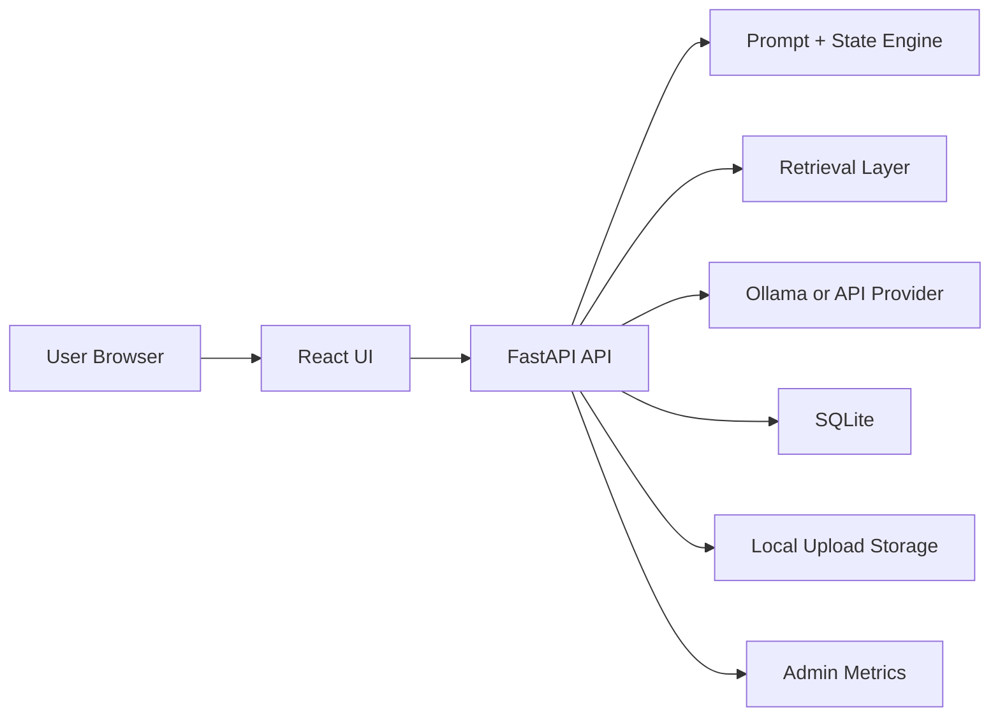
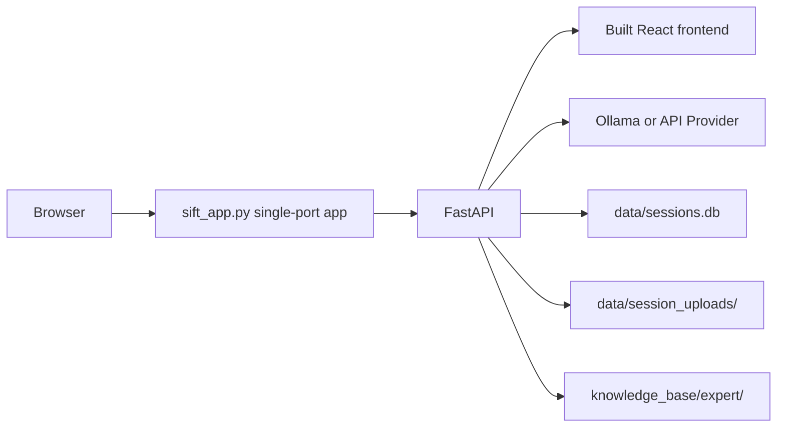
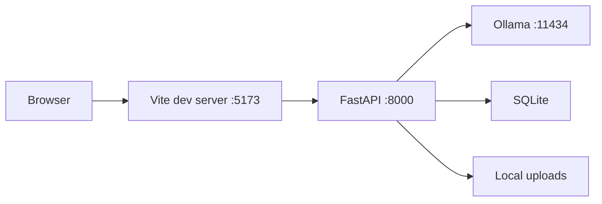
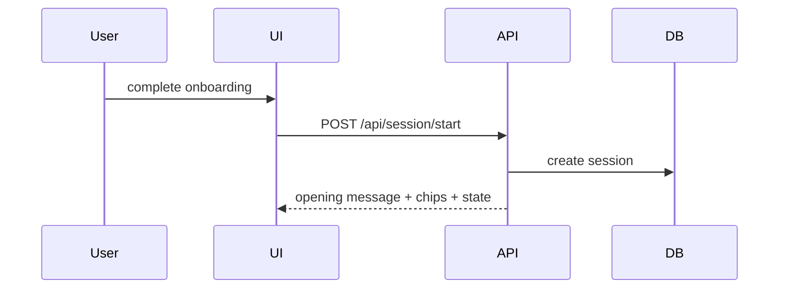
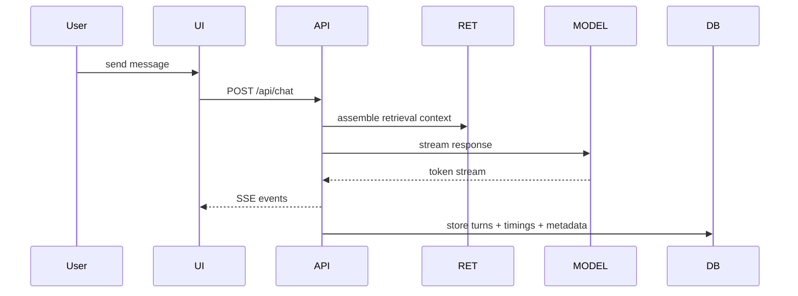
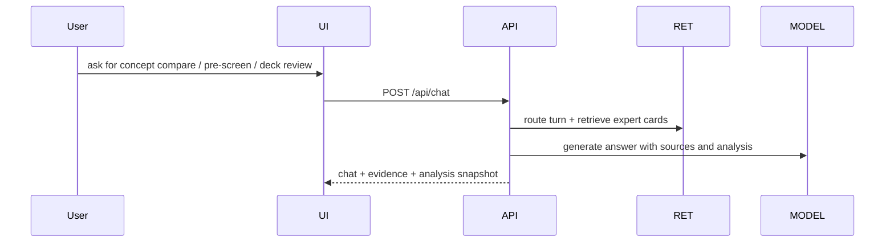
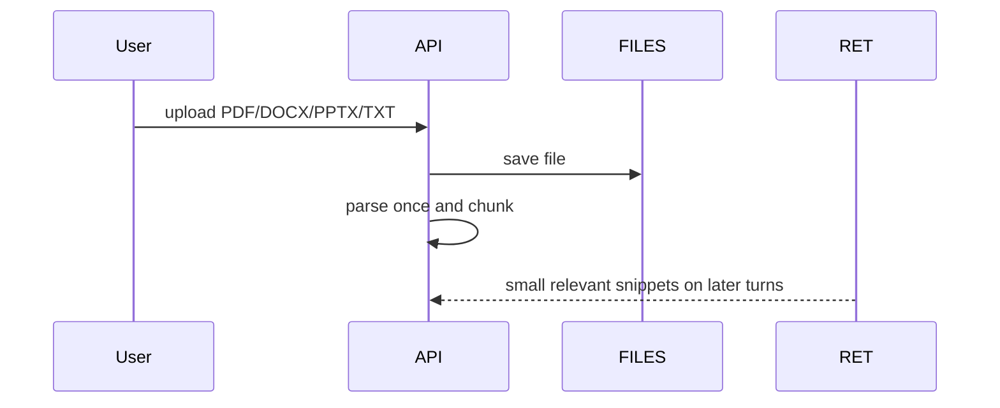
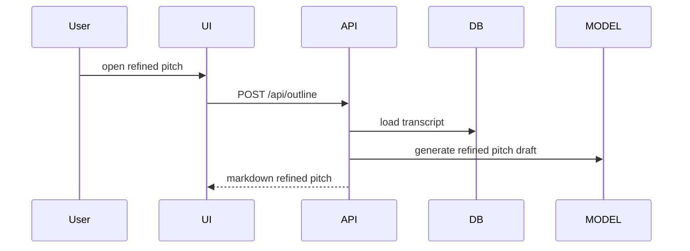
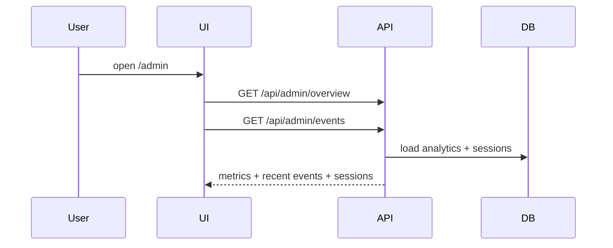

# Sift Platform Overview

This is the single handoff document for the current Sift platform.

It explains:
- what the product is
- what the current MVP includes
- the complete architecture
- the major components
- the supported use cases
- the key routes and ports
- the exact commands to configure and run it

This document is written for product, technical, and operator review.

## 1. What Sift Is

Sift is a startup and finance workbench with three workflows:
- `Ideate` for open-ended, two-way idea shaping
- `Evaluate` for sharper, evidence-driven assessment
- `Expert` for domain discussion, concept learning, pre-screening, and deck analysis

It is not meant to behave like a generic chatbot.

Its job is to help a student, founder, operator, investor, or professional:
- clarify the real problem
- test assumptions
- think in terms of customer evidence, not just opinions
- explain the business in simple language when needed
- turn a messy idea into a sharper pitch, evaluation report, or expert analysis

## 2. Current MVP Scope

The current MVP is local-first, but not open-source-only.

It uses:
- `React` frontend
- `FastAPI` backend
- `Ollama` for local model inference
- API-key providers for hosted inference
- `SQLite` for sessions and analytics
- local disk for uploaded files
- a bundled Expert knowledge corpus under `knowledge_base/expert/`

It already includes:
- onboarding
- role-aware setup
- persistent sessions
- streamed mentor responses
- uploaded file parsing and retrieval
- refined pitch generation
- Expert workbench with evidence panels
- starter chips
- a clean one-screen chat UI
- an internal admin route for usage monitoring
- a clear-history reset for old local sessions

It does not yet include:
- cloud auth
- managed database
- managed object storage
- multi-user production security
- public internet hardening

## 3. Current Stack

### Frontend

- `Vite`
- `React`
- `TypeScript`
- custom CSS only

### Backend

- `FastAPI`
- `Uvicorn`
- `Pydantic`

### Model Layer

- `Ollama`
- `Groq`
- `Cerebras`
- `OpenAI`
- `OpenRouter`
- `Anthropic`
- `Gemini`
- default local speed model: `llama3.2:latest`
- optional local balanced model: `qwen3:8b`
- hosted public default: `Groq` with `openai/gpt-oss-20b` for fast turns and `openai/gpt-oss-120b` for sharper turns
- frontier OpenAI lane: `gpt-5.4-mini` for fast turns and `gpt-5.5` for sharper turns

### Persistence

- `SQLite` via `memory.py`
- uploads stored under `data/session_uploads/`

## 4. Product Use Cases

### Student

The mentor should:
- use simple language
- explain startup terms in plain English
- ask narrower, less intimidating questions
- focus on problem clarity and early validation

### Professional / operator

The mentor should:
- translate domain knowledge into startup language
- pressure-test customer, buyer, and workflow assumptions
- move from industry intuition to evidence

### First-time founder

The mentor should:
- balance problem, solution, validation, and narrative
- keep the founder from jumping too fast to metrics
- help turn an idea into a sharper pitch story

### Repeat founder

The mentor should:
- skip basics
- challenge assumptions faster
- focus on what is different and why it matters

### Investor / analyst

The expert workbench should:
- explain domain concepts without becoming generic
- compare frameworks and terms cleanly
- cite its reasoning and surface gaps
- pre-screen decks and opportunities

### Friend / local tester

The app should:
- run locally with one command
- be shareable on the local network
- let testers return to earlier sessions
- give the owner a simple admin view of activity

## 5. High-Level Architecture



## 6. Runtime Architecture

### A. Normal MVP mode



This is the main mode for demoing the MVP.

### B. Development mode



This is the mode for active development.

## 7. Core Workflows

### Session start



### Ideate / Expert chat



### Expert analysis



### Upload



### Refined pitch



### Admin monitoring



## 8. Main Components

### Frontend components

- `frontend/src/app/App.tsx`
  - root app shell
  - route handling
  - session bootstrapping
  - client identity persistence

- `frontend/src/features/onboarding/LandingScreen.tsx`
  - entry screen
  - identity capture
  - auth launch points

- `frontend/src/features/onboarding/SetupWizard.tsx`
  - runtime selection
  - user role selection
  - mode selection

- `frontend/src/features/chat/ChatScreen.tsx`
  - Ideate chat shell
  - chips
  - uploads
  - compact pitch map
  - session switching

- `frontend/src/features/outline/OutlineScreen.tsx`
  - refined pitch document view

- `frontend/src/features/evaluator/EvaluatorScreen.tsx`
  - Evaluate workspace
  - adaptive questioning
  - hidden scoring until report time

- `frontend/src/features/evaluator/EvaluatorReportScreen.tsx`
  - document-style evaluation report

- `frontend/src/features/expert/ExpertScreen.tsx`
  - Expert workbench
  - evidence rail
  - source and analysis panels

- `frontend/src/features/admin/AdminScreen.tsx`
  - visitor/session metrics
  - recent activity
  - recent sessions

### Backend API modules

- `backend/main.py`
  - API startup
  - frontend asset serving
  - health endpoint

- `backend/api/session.py`
  - start session
  - list sessions
  - load session

- `backend/api/chat.py`
  - streamed chat
  - turn persistence
  - upload-aware messaging

- `backend/api/outline.py`
  - refined pitch generation

- `backend/api/client.py`
  - local browser heartbeat

- `backend/api/analytics.py`
  - frontend event capture

- `backend/api/admin.py`
  - admin overview and recent activity

### Backend service modules

- `backend/services/prompting.py`
  - Ideate behavior
  - Evaluate phrasing rules
  - role-aware adaptation
  - simple-language logic

- `backend/services/retrieval.py`
  - KB-grounded prompt context assembly

- `backend/services/expert_knowledge.py`
  - expert corpus loading
  - hybrid retrieval helpers
  - taxonomy-aware routing hints

- `backend/services/expert_agent.py`
  - Expert workflow orchestration
  - analysis snapshots
  - source-backed expert responses

- `backend/services/external_sources.py`
  - compact investor-style questioning lenses

- `backend/services/state_engine.py`
  - deterministic state updates
  - coverage progression

- `backend/services/uploads.py`
  - parsing
  - chunking
  - lexical retrieval from uploaded files

- `backend/services/model_router.py`
  - current local provider routing
  - Ollama profiles
  - optional future provider path

### Persistence modules

- `memory.py`
  - session storage
  - turn storage
  - analytics event storage
  - admin aggregates

## 9. Data Stored Locally

### SQLite database

File:

```text
data/sessions.db
```

Stores:
- sessions
- turns
- analytics events

### Uploaded files

Folder:

```text
data/session_uploads/
```

Stores:
- original uploaded file
- chunk manifests
- per-session retrieval data

## 10. Routes And Endpoints

### User-facing routes

- `/`
  - onboarding or chat

- `/outline/:sessionId`
  - structured pitch outline

- `/admin`
  - admin metrics page

### API endpoints

- `GET /api/health`
- `POST /api/session/start`
- `GET /api/session`
- `GET /api/session/{sessionId}`
- `POST /api/chat`
- `POST /api/outline`
- `POST /api/client/heartbeat`
- `POST /api/analytics/event`
- `GET /api/admin/overview`
- `GET /api/admin/events`

## 11. Ports

### One-command MVP mode

- `7860`
  - frontend + backend on one port

### Dev mode

- `5173`
  - Vite frontend

- `8000`
  - FastAPI backend

- `11434`
  - Ollama

## 12. Monitoring

### What the admin page shows today

- unique visitors
- total sessions
- total chat completions
- uploads
- outline opens
- average first-token latency
- average total response time
- recent activity events
- recent sessions

### Event types tracked

Examples:
- `page_view`
- `session_started`
- `session_resumed`
- `file_uploaded`
- `chat_completed`
- `outline_opened`
- `outline_viewed`

## 13. Open-Source-Only Configuration

Use this in `.env` for fully local open-source mode:

```env
SIFT_MODEL_PROVIDER=ollama
SIFT_DATA_DIR=data
OLLAMA_BASE_URL=http://127.0.0.1:11434
OLLAMA_MODEL_SPEED=llama3.2:latest
OLLAMA_MODEL_BALANCED=qwen3:8b
SIFT_ADMIN_TOKEN=
```

For API-key mode, use:

```env
SIFT_MODEL_PROVIDER=groq
SIFT_EXPERT_DATA_DIR=knowledge_base/expert
```

If you want admin protected locally or on LAN, set:

```env
SIFT_ADMIN_TOKEN=your_secret_token
```

## 14. One-Time Setup Commands

Run from the project root:

```bash
cd /Users/saimihirj/Desktop/Ideas/sift
python3 -m venv .venv
source .venv/bin/activate
pip install -r requirements.txt
npm install
npm --prefix frontend install
cp .env.example .env
```

The local launcher auto-starts Ollama when needed.

If using open-source local mode, pull the local models:

```bash
ollama pull llama3.2
ollama pull qwen3:8b
```

## 15. Final Run Commands

### Normal MVP app

```bash
cd /Users/saimihirj/Desktop/Ideas/sift
source .venv/bin/activate
npm run mvp
```

Open:

```text
http://127.0.0.1:7860
```

### Admin directly

```bash
cd /Users/saimihirj/Desktop/Ideas/sift
source .venv/bin/activate
npm run admin
```

Open:

```text
http://127.0.0.1:7860/admin
```

### LAN share

```bash
cd /Users/saimihirj/Desktop/Ideas/sift
source .venv/bin/activate
npm run mvp:lan
```

Open the LAN URL shown in the terminal.

Admin on LAN:

```text
http://YOUR-LAN-IP:7860/admin
```

### Dev mode

```bash
cd /Users/saimihirj/Desktop/Ideas/sift
source .venv/bin/activate
npm run dev
```

Open:

```text
http://127.0.0.1:5173
```

### Docker

```bash
cd /Users/saimihirj/Desktop/Ideas/sift
docker build -t sift .
docker run -p 8000:8000 --env-file .env sift
```

Open:

```text
http://127.0.0.1:8000
```

## 16. Practical Recommendation

For your current POC / MVP, the simplest and right setup is:

1. keep everything local and open-source-only
2. use `Ollama`
3. run the app with `npm run mvp`
4. use `npm run admin` when you want to inspect access and activity
5. use `npm run mvp:lan` only when you want your co-founder to test on the same network

That keeps the system clean, cheap, understandable, and easy to demo.
